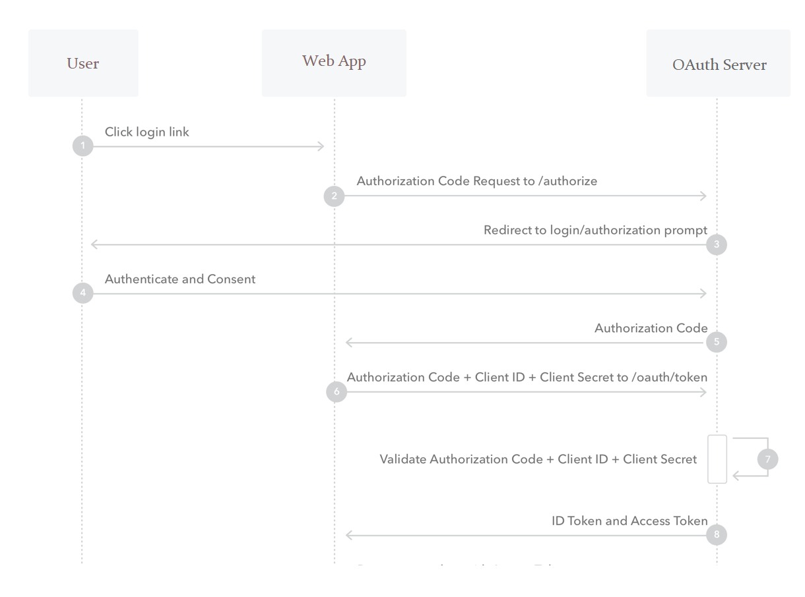

# Flask Google Login Demo

This repo use as demo for google login by SSO (single sign on) using `authlib` library

## The flow of login:
we have `AppID`, `AppSecret`. we will use it to transfer as `client_id` and `client_secret`

click login

-> redirect to `google.com/authenticate?client_id=..&scope=..` 
-> render google login page, user input data and click on submit 
-> google check and provide us `authorize code` and redirect to callback url: `127.0.0.1:5000/auth-callback?authorize_code=..` 
-> from above url, we will redirect to `google.com/authorize?authorize_code=..&client_id=..&client_secret=..` 
-> google check and provide us `access token` and `refresh token` 

-> now, we use that access token to call to our `127.0.0.1:5000`

## Why call 2 time to google?

The first call is for authenticate, they will return authorize code, then in second call, they will return access token and refresh token. 
This is for improve the security.